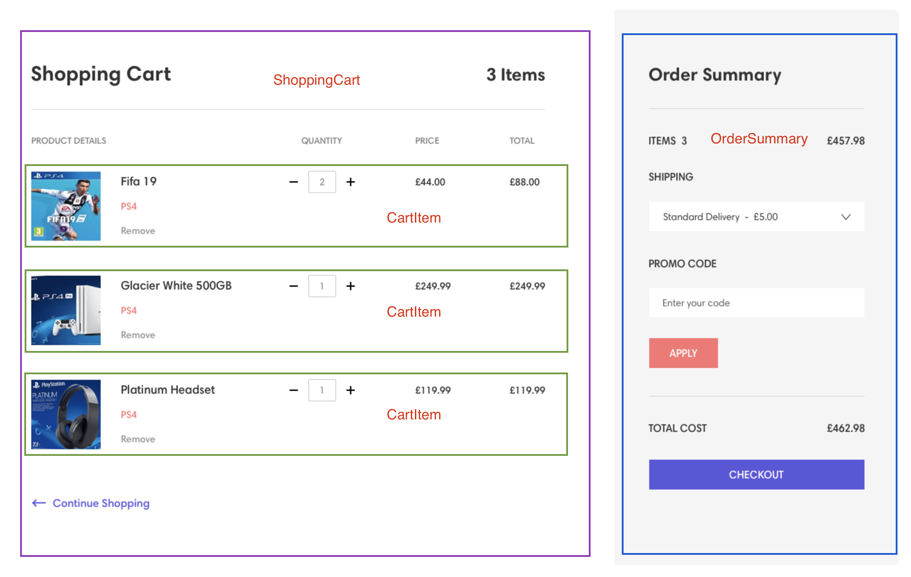

## Shopping Cart

This is a shopping cart in which you can view the products in the shopping cart, change the number of products, and even delete products. The total price excluding express fee and including express fee is shown in the order summary.

## Available Scripts

In the project directory, you can run:

### `npm start`

Runs the app in the development mode.\
Open [http://localhost:3000](http://localhost:3000) to view it in the browser.

The page will reload if you make edits.\
You will also see any lint errors in the console.

### `npm test`

Launches the test runner in the interactive watch mode.\
See the section about [running tests](https://facebook.github.io/create-react-app/docs/running-tests) for more information.

---

## 作业要求

Design Mockup： https://dribbble.com/shots/5311395-Shopping-Cart/attachments/5311395?mode=media

- 前端：React，Sass，Redux，Test
- 后端：Express.js, UnitTest, DB (MySQL/MongoDB),
- GitHub, Docker
- 先做 tasking，然后一步一步完成，全程小不提交

## 功能

1. 商品列表，增删改
2. 通过+ - 按钮，可以增减每个商品数量，并且价格和商品总价实时变更
3. 一切数据均实时同步数据库，数据库表结构自行设计
4. UI 不要求 responsive，不影响功能的情况下可以适当的自由发挥，尽量还原 mockup

## Tasking

- 组件划分
- react，scss 完成静态页面
- 数据结构的设计
- 添加假数据显示在静态页面
- 使用 redux 管理组件间的通信
- 添加动态功能（加减数量）
- 添加删除商品功能
- 添加 order summary 中同步计算总价的功能
- 后端搭建，连接 MongoDB
- 添加 post， delete， patch API
- 使用 redux thunk 中间件，从后端获取数据
- 修改功能，使变更商品数量时同时更改数据库中的数量

## 组件划分

